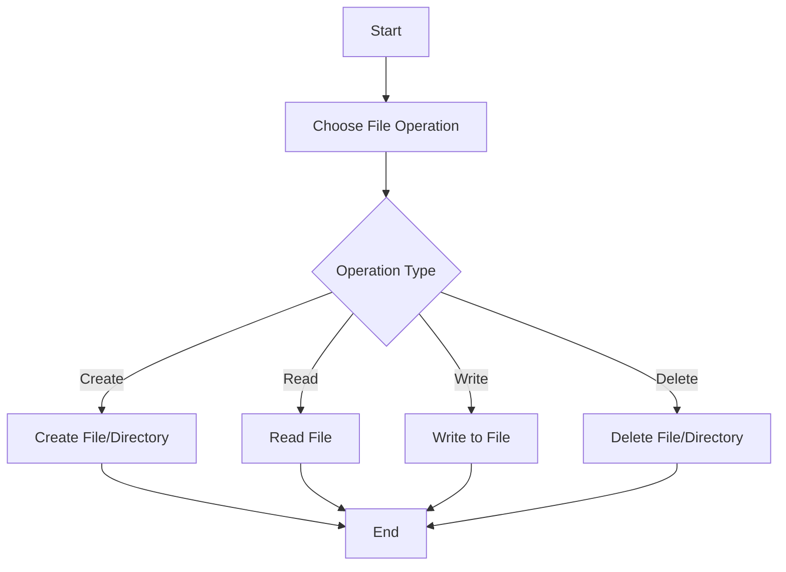

A file system manages the storage and retrieval of data on a disk. It handles operations such as creating, reading, writing, and deleting files, as well as organizing these files into directories.

## **Key Concepts**

- **File**: The basic unit of data storage. A file can contain text, images, programs, or other types of data.
- **Directory (or Folder)**: A container for files and other directories, used to organize and structure data.
- **Path**: The location of a file or directory within the file system hierarchy, usually specified as a sequence of directory names ending with the file or directory name.
- **File Metadata**: Information about a file, including its name, size, creation/modification dates, and permissions.
- **File System Types**: Various file systems are designed for different purposes and storage devices, such as NTFS for Windows, EXT4 for Linux, and APFS for macOS.

## **File Operations**

### **Creating a File**

In most programming environments, you can create a file using built-in libraries or system calls.

```Python

# Creating a file in Python
with open('example.txt', 'w') as f:
    f.write('Hello, world!')

```

### **Reading and Writing Files**

Opening a file for reading or writing, performing the operation, and then closing the file is a common sequence of actions.

```Python

# Reading from a file in Python
with open('example.txt', 'r') as f:
    content = f.read()
    print(content)

```

### **Deleting a File**

File deletion is typically performed through a system call or function provided by the OS or programming language's standard library.

```Python

import os

# Deleting a file in Python
os.remove('example.txt')

```

## **Directory Management**

Directories are managed similarly to files, with operations for creating, listing, and deleting directories.

```Python

import os

# Creating a directory
os.mkdir('new_directory')

# Listing contents of a directory
for item in os.listdir('.'):
    print(item)

# Removing a directory
os.rmdir('new_directory')

```

## **File System Hierarchy**

The file system is typically structured as a tree, with the root directory at the base and branches for subdirectories and files.

### **Example Hierarchy**

```Plain
plaintextCopy code
/
├── bin
│   └── ls
├── home
│   ├── user1
│   │   └── document.txt
│   └── user2
└── var
    └── log

```

## **Permissions**

File systems implement permissions to control access to files and directories. Common permissions include read (r), write (w), and execute (x), which can be set for the file owner, the owner's group, and others.

### **Changing Permissions**

In Unix-like systems, the `**chmod**` command is used to change file permissions.

```Shell
bashCopy code
chmod 755 example.txt

```

