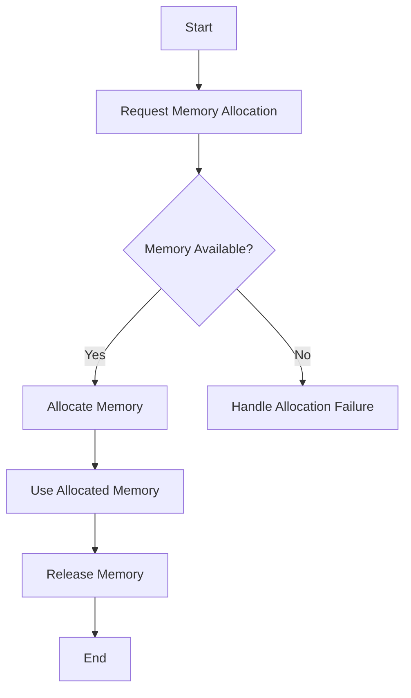

Memory management is a critical aspect of computer science, involving the allocation, management, and recycling of memory resources in a computer system. It's fundamental to both system and application software, ensuring efficient and effective use of memory.



## **Overview**

Memory management allows programs to dynamically allocate memory from the heap during runtime, as opposed to static memory allocation on the stack. Effective memory management optimizes performance and prevents issues like memory leaks and fragmentation.

## **Key Concepts**

- **Stack vs. Heap**: The stack is for static memory allocation (e.g., fixed-size variables), while the heap is for dynamic memory allocation.
- **Memory Allocation**: Allocating memory at runtime using functions like `**malloc()**` in C or `**new**` in C++.
- **Memory Deallocation**: Releasing unused memory back to the system using functions like `**free()**` in C or `**delete**` in C++.
- **Garbage Collection**: Automatic memory management found in languages like Java and Python, where the system automatically reclaims memory that is no longer in use.
- **Memory Leaks**: Occur when a program allocates memory but fails to release it, leading to wasted resources.
- **Fragmentation**: When memory is frequently allocated and deallocated, it can become fragmented, leading to inefficient use of memory.

## **Memory Allocation in C**

When allocating memory dynamically, it's crucial to ensure that it's later deallocated to prevent memory leaks.

### **Allocating Memory**

```C

int* ptr = (int*)malloc(sizeof(int));  // Allocate memory for an integer
if (ptr == NULL) {
    // Handle allocation failure
}

```

### **Using the Allocated Memory**

```C

*ptr = 10;  // Assign a value to the allocated memory

```

### **Deallocating Memory**

```C

free(ptr);  // Release the allocated memory back to the heap
ptr = NULL;  // Good practice to avoid dangling pointers

```

## **Garbage Collection**

In languages with garbage collection, the runtime periodically scans for objects that are no longer reachable or in use and frees their memory.

### **Example in Java**

```Java
javaCopy code
String str = new String("Hello, World!");  // Memory allocated for the string
str = null;  // Now eligible for garbage collection

```

## **Best Practices**

- Always deallocate dynamically allocated memory when it's no longer needed.
- Avoid unnecessary allocations to minimize the risk of memory leaks and fragmentation.
- Use tools like Valgrind to detect memory leaks and other memory-related issues in your code.