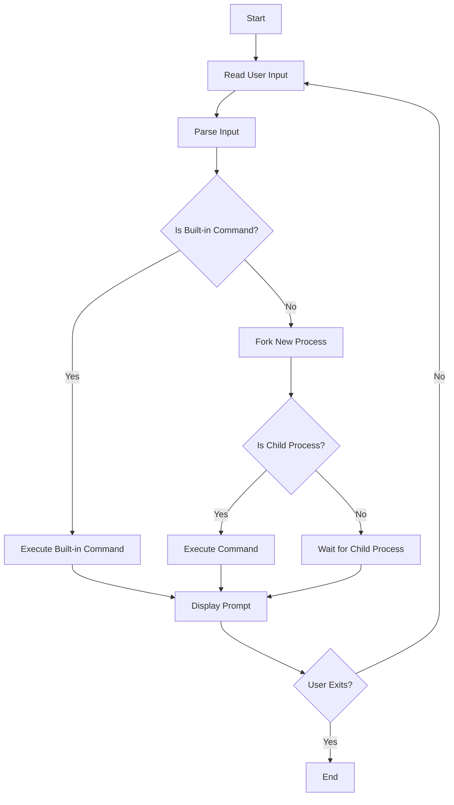

In this project, we're going to build a simple shell program. A shell is a user interface for accessing an operating system's services, usually through a command-line interface. Our simple shell will interpret and execute user commands.

## **Objective**

- Understand the workings of command-line interfaces.
- Learn how to parse and execute commands.
- Implement basic functionalities of a shell: executing commands, handling arguments, and providing user feedback.

## **Key Concepts**

- **Command Line Parsing**: Splitting the user input into a command and its arguments.
- **Process Creation**: Using system calls like `**fork()**` to create processes.
- **Command Execution**: Utilizing system calls such as `**execvp()**` to execute commands.
- **Input/Output Redirection**: Handling redirection operators (`**>**`, `**<**`) to redirect command input and output.
- **Pipes**: Implementing pipes (`**|**`) to direct the output of one command as input to another.

## **Implementation Steps**

1. **Setup Development Environment**
    - Ensure you have a suitable C or C++ compiler and debugging tools installed.
2. **Parse User Input**
    - Read input from the user.
    - Parse the input to separate the command from its arguments.

```C

char* input = read_input();  // Function to read input from the user
char** args = parse_input(input);  // Function to parse the input into command and arguments

```

1. **Process Creation**
    - Use `**fork()**` to create a new process where the command will be executed.

```C

pid_t pid = fork();
if (pid == 0) {
    // Child process
    execvp(args[0], args);  // Execute the command
} else if (pid > 0) {
    // Parent process
    wait(NULL);  // Wait for the child process to finish
} else {
    // Error handling
}

```

1. **Command Execution**
    - In the child process, use `**execvp()**` or a similar function to execute the command.
2. **Adding Built-in Commands**
    - Implement built-in functions like `**exit**`, `**cd**` (change directory), and `**help**`.
3. **Input/Output Redirection and Pipes**
    - Handle special characters for redirection and pipes, adjusting file descriptors accordingly.

## **Simple Shell Workflow**



## **Reflection**

Creating a simple shell introduces you to low-level system programming concepts, such as process management, file I/O, and inter-process communication. This project provides hands-on experience with the Unix/Linux operating system's foundational principles and how shell commands are interpreted and executed. It's a great exercise in understanding how the user interacts with the operating system at a fundamental level.